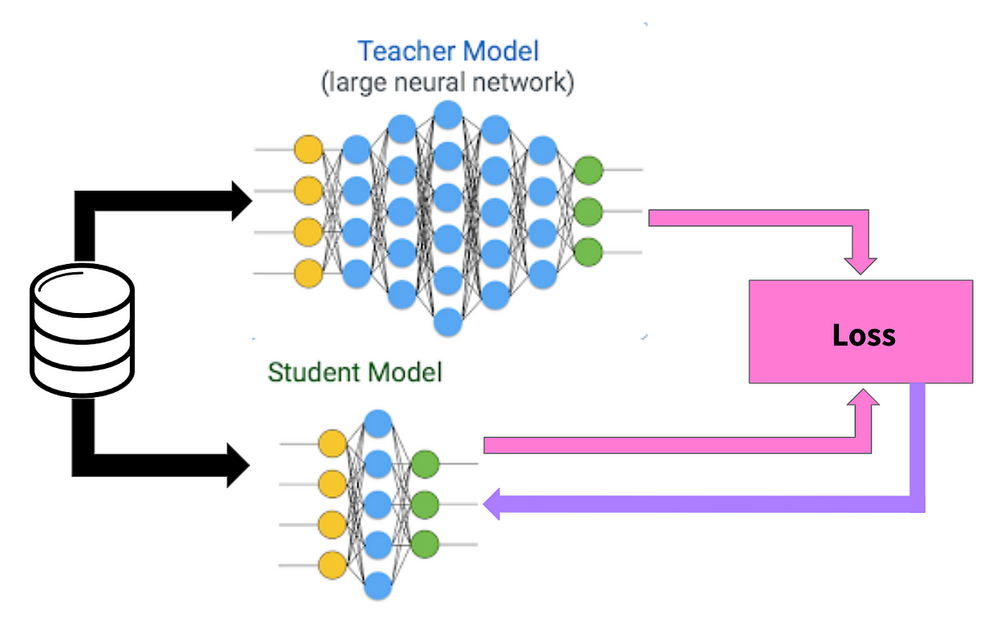
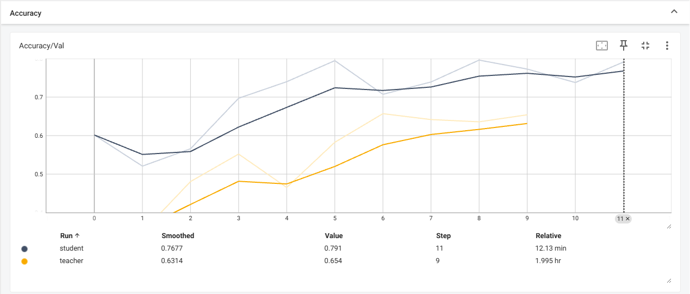
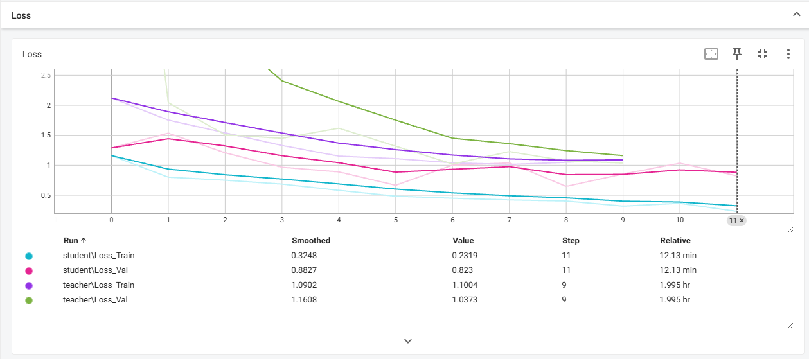
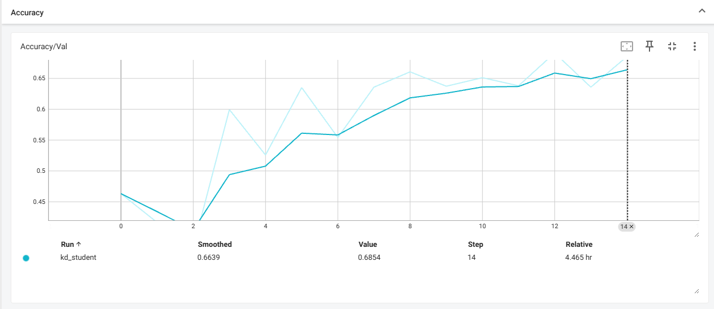
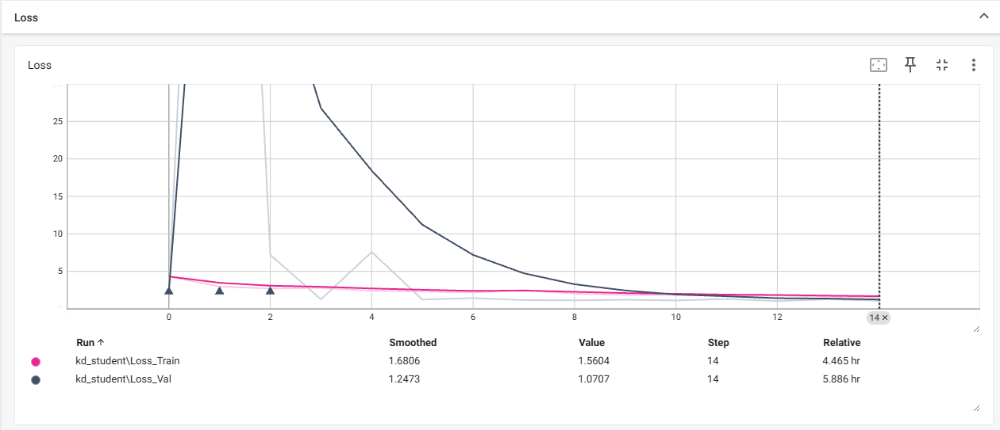
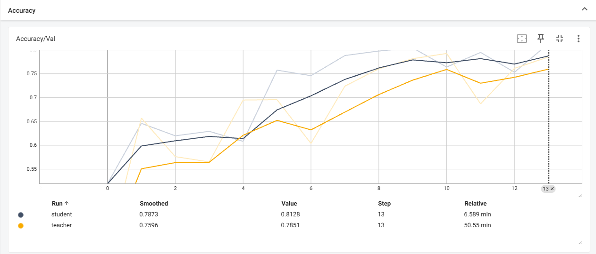
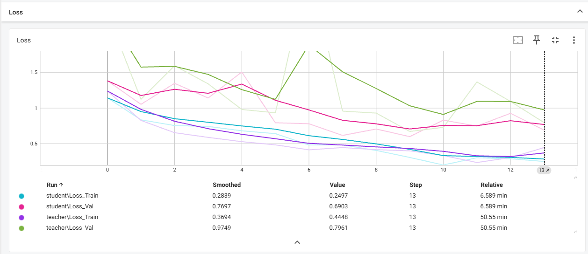

# Knowledge Distillation Implementation for Weather Classification

## Project Description
This project implements knowledge distillation (KD) techniques to improve model training efficiency by transferring knowledge from a larger teacher model to a more compact student model. The implementation focuses on response-based knowledge distillation for weather classification across 11 weather types.

## Table of Contents
- [Dataset Information](#dataset-information)
- [Knowledge Distillation Concepts](#knowledge-distillation-concepts)
- [Implementation Details](#implementation-details)
- [How to Run the Project](#how-to-run-the-project)
- [Experimental Results](#experimental-results)
- [Conclusion](#conclusion)

## Dataset Information
The weather dataset contains 11 categories of weather conditions:

- **Download link**: [Weather Dataset](https://drive.google.com/file/d/1fnJMMw0LvDgl-GS4FTou5qAgLxOE2KQ0/view)
- **Dataset split**:
  - Training set: 70%
  - Validation set: 20%
  - Test set: 10%

## Knowledge Distillation Concepts

### Three Approaches to Knowledge Distillation

1. **Response-based Knowledge**  
   Utilizes the teacher model's output logits to guide the student model (implemented in this project)
   
   

2. **Feature-based Knowledge**  
   Leverages information from the teacher's hidden layers to teach feature representation

3. **Relation-based Knowledge**  
   Focuses on relationships between data points in the feature space

### Loss Function Implementation
The knowledge distillation loss combines cross-entropy and Kullback-Leibler divergence:

$$
L_{KD} = (1-\alpha) \cdot L_{CE}(y, y_{s}) + \alpha \cdot T^{2} \cdot L_{KL}(p(y_{t},T) \parallel p(y_{t}, T))
$$

Where the KL divergence is calculated as:

$$
L_{KL}(p_t \parallel p_s) = \sum_{i} p_{t,i} \cdot (\log(p_{t,i}) - \log(p_{s,i}))
$$

**Parameters**:
- $L_{CE}$: Cross-entropy loss
- $\alpha$: Weight for teacher model contribution (0 ≤ α ≤ 1)
- $T$: Temperature parameter (softens probability distributions)
- $p_t$: Teacher model's softened probabilities
- $p_s$: Student model's softened probabilities

## Implementation Details

### Model Architecture

- Experiment_1
    - **Teacher Model**: DenseNet169 (14.3M parameters)
    - **Student Model**: ResNet18 (11.7M parameters)

- Experiment_2
    - **Teacher Model**: ResNet50 
    - **Student Model**: ResNet18 

### Training Configuration
- Epochs: 15
- Batch size: 32
- Learning rate: 0.001
- Hardware: Single GPU

## How to Run the Project

### Environment Setup

```bash
# Create new conda environment
conda create -n kd_env python=3.11
conda activate kd_env

# Install Poetry package manager and dependencies
pip install poetry
poetry install
```

### Running the Code
- To run the training script for the basic result:

    ```bash
    poetry run python train.py
    ``` 

    or

    ```bash
    python train.py
    ```

- To run the training script for the knowledge distillation result:

    ```bash
    poetry run python knowledge_distillation.py
    ``` 

    or

    ```bash
    python knowledge_distillation.py
    ```

- Run tensorboard for the graph result:

    ```
    tensorboard --logdir=output/logs
    ```

## Experimental Results
### Experiment 1: DenseNet169 vs ResNet18


- Results Without Knowledge Distillation

    | Metric                  | Teacher | Student |
    |-------------------------|---------|---------|
    | Best Validation Loss    | 1.020   | 0.648   |
    | Best Validation Accuracy| 0.657   | 0.796   |
    | Final Training Loss     | 1.100   | 0.232   |
    | Final Validation Loss   | 1.037   | 0.823   |
    | Final Validation Accuracy| 0.654  | 0.791   |
    | Test Loss               | 1.034   | 0.825   |
    | Test Accuracy           | 0.654   | 0.771   |

    
    

- **Key Observations:**
    - The student model (ResNet18) outperformed the teacher model (DenseNet169) across all metrics
    - Contrary to initial expectations, the model with fewer parameters achieved better performance
    - This result prompted a role reversal in subsequent experiments (using ResNet18 as teacher)

- Results With Knowledge Distillation

    | Metric                  | Teacher | Student | KD Student |
    |-------------------------|---------|---------|------------|
    | Best Validation Loss    | 1.020   | 0.648   | 1.037      |
    | Best Validation Accuracy| 0.657   | 0.796   | 0.691      |
    | Final Training Loss     | 1.100   | 0.232   | 1.560      |
    | Final Validation Loss   | 1.037   | 0.823   | 1.071      |
    | Final Validation Accuracy| 0.654  | 0.791   | 0.685      |
    | Test Loss               | 1.034   | 0.825   | 1.018      |
    | Test Accuracy           | 0.654   | 0.771   | 0.680      |

    
    

- **Key Observations:**
    - Knowledge distillation provided marginal improvement over standalone training
    - The technique was not particularly effective in this configuration

### Experiment 2: ResNet50 vs ResNet18

- Results Without Knowledge Distillation

    | Metric                  | Teacher | Student |
    |-------------------------|---------|---------|
    | Best Validation Loss    | 0.672   | 0.599   |
    | Best Validation Accuracy| 0.792   | 0.813   |
    | Final Training Loss     | 0.445   | 0.250   |
    | Final Validation Loss   | 0.796   | 0.690   |
    | Final Validation Accuracy| 0.785  | 0.813   |
    | Test Loss               | 0.727   | 0.716   |
    | Test Accuracy           | 0.781   | 0.803   |

    
    

- **Key Observations:**
    - The student model (ResNet18) outperformed the teacher model (ResNet50) across all metrics
    - The same phenomenon as in Experiment 1 was observed, where the model with fewer parameters achieved better performance
    - This could be attributed to the teacher model's overfitting to the training data or maybe the dataset being too small for the teacher model's complexity or the parameters need to be tuned for the teacher model

- Result with Knowledge Distillation is really bad though, it's even worse than the basic result of the student model (which is Resnet 50 here)

## Conclusion
This project successfully implemented knowledge distillation techniques for weather classification. It shows that the method still has potential for improving model performance. 
However, in this project, the results indicate that the student model can outperform the teacher model in certain configurations. The knowledge distillation approach doesn't always yield significant improvements, and in some cases, it may even lead to worse performance. This suggests that while knowledge distillation is a valuable technique, its effectiveness can vary based on the specific models and datasets used. Further experimentation with different architectures and hyperparameters is recommended to optimize performance.